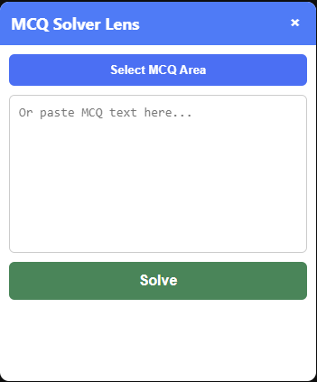

# MCQ Solver Chrome Extension

An AI-powered Chrome extension that helps users solve multiple-choice questions instantly by selecting questions directly from the screen.

## 🚀 Features
- Select MCQs directly from screen
- Extracts text using OCR (Tesseract.js)
- Generates answers instantly
- Clean and simple user interface

## 📷 Demo

## 💡 Use Case
This tool is designed for students to quickly solve and understand MCQs during study sessions and practice tests.

## 🛠 Tech Stack
- JavaScript
- HTML/CSS
- Chrome Extension APIs
- Tesseract.js (OCR)

## ⚙️ How It Works
1. Click on the extension
2. Select MCQ area or paste question
3. Click "Solve"
4. Get instant answer

## 📌 Status
Working prototype – further improvements in AI accuracy and explanation features are planned.